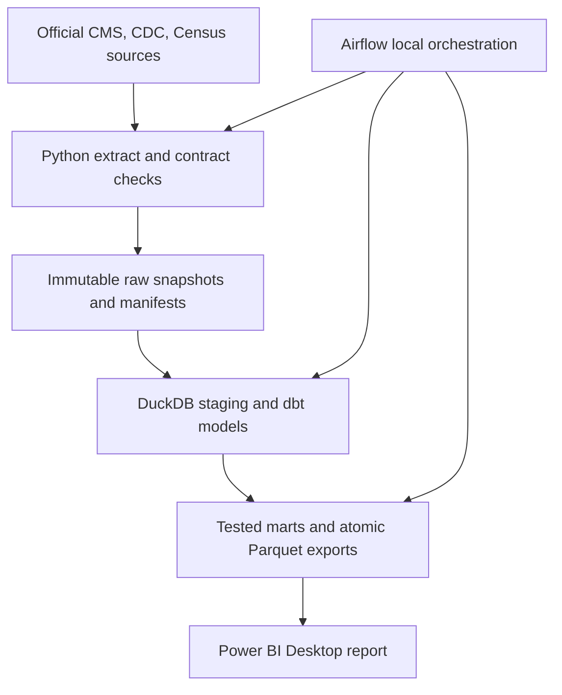

# Kidney Care Analytics Mart — Product and Engineering Specification

**Status:** Draft v0.1  
**Research and feasibility review:** 2026-08-13  
**Artifact scope:** Specification only; implementation is intentionally deferred  
**Geographic scope:** 50 U.S. states and the District of Columbia

## 1. Executive decision

Build a reproducible, test-driven county screening mart that helps a hypothetical kidney-care strategy analyst identify U.S. counties for further due diligence using:

- observed Original Medicare outpatient dialysis use and standardized spending;
- CDC/ATSDR social vulnerability context; and
- current dialysis-facility capacity, ownership, availability, and CMS quality signals.

The product is a **screening and investigation tool**. It must not make or imply final site-selection, partnership, contracting, clinical, patient-targeting, or intervention decisions.

### Feasibility verdict

The project is feasible with public, aggregate, non-PHI data and a no-cost local core toolchain. No source requires a paid data license, CMS API key, or patient-data access.

Two user-specific preflight checks remain:

1. Power BI Desktop requires access to a supported 64-bit Windows machine.
2. The Airflow Docker environment requires at least 4 GB allocated to containers; 8 GB is preferred.

Neither condition blocks development of the Python/dbt/DuckDB mart. If Windows access is unavailable, the mart and Parquet deliverables remain complete, but the Power BI acceptance criteria remain blocked until Windows access exists.

## 2. Project goals

### 2.1 Product goal

Answer this bounded decision question:

> Which U.S. counties combine high observed outpatient dialysis use among Original Medicare beneficiaries and high social vulnerability, and what current facility characteristics should an analyst examine before deciding whether deeper market research is warranted?

### 2.2 Portfolio goals

The finished project must demonstrate, with inspectable evidence:

| ID | Goal | Evidence required |
|---|---|---|
| G-01 | Public-data ingestion in Python | Resilient extractors, immutable raw snapshots, source manifests, and tests |
| G-02 | Advanced SQL and dimensional modeling | Documented grains, conformed dimensions, facts, marts, and reconciliation queries |
| G-03 | Analytics engineering with dbt | Sources, models, unit tests, data tests, documentation, and lineage |
| G-04 | Test-driven development | Failing fixtures/tests precede transformation logic for each critical rule |
| G-05 | Workflow orchestration | An idempotent Airflow DAG with retries, quality gates, logs, and no-op refreshes |
| G-06 | Decision-facing BI | A focused Power BI report whose measures reconcile to published mart outputs |
| G-07 | Reproducibility and governance | Locked dependencies, source/version provenance, metric definitions, and a runbook |
| G-08 | Clear healthcare reasoning | Claims respect denominators, source vintages, suppression, and analytical limits |

### 2.3 Success outcomes

The project succeeds when another analyst can:

1. clone the repository and build the mart from documented commands;
2. reproduce the same published result from the same pinned source manifests;
3. trace every dashboard measure to a governed mart field and source definition;
4. see why a county entered a screening quadrant without interpreting an opaque score; and
5. distinguish valid analytical findings from unsupported clinical or causal claims.

## 3. Explicit non-goals

The MVP will not include:

- patient-level data, PHI, claims-line data, or synthetic patient records;
- CKD prevalence estimation, patient-risk prediction, clinical decision support, or intervention targeting;
- causal inference or claims that vulnerability, facility characteristics, or dialysis use causes an outcome;
- a proprietary or black-box “opportunity,” “need,” or “quality” score;
- final provider ranking, contracting, partnership, or site-selection recommendations;
- real-time or streaming ingestion;
- tract-level GIS, drive-time analysis, network adequacy, or facility catchment modeling;
- cross-year comparison of SVI percentile ranks;
- historical reconstruction of the Dialysis Facility Care Compare dataset;
- incremental dbt models, SCD Type 2 dimensions, Kubernetes, or an Airflow Celery cluster;
- mandatory AWS, dbt Cloud, Power BI Service, authentication, or public hosting;
- a machine-learning model, semantic-layer product, GenAI assistant, or automated narrative generation.

## 4. Decision logic

### 4.1 Primary screen

Use a transparent 2×2 screen for the latest published Original Medicare year:

- **High observed outpatient dialysis use:** county `BENES_OP_DLYS_PCT` is at or above the national county 75th percentile among in-scope, nonsuppressed county rows.
- **High social vulnerability:** county `RPL_THEMES >= 0.75` in the U.S.-based 2022 SVI county file.
- **Insufficient data:** either component is null, suppressed, invalid, or unavailable.

The four complete-data quadrants are:

1. higher use / higher vulnerability;
2. higher use / lower vulnerability;
3. lower use / higher vulnerability; and
4. lower use / lower vulnerability.

Facility characteristics provide due-diligence context only. They do not change the quadrant.

### 4.2 Required language

Use “observed outpatient dialysis use among Original Medicare beneficiaries.” Do not substitute “kidney disease prevalence,” “unmet need,” “disease burden,” or “intervention opportunity.” The selected sources do not establish those concepts.

### 4.3 Secondary questions

- How has observed county outpatient dialysis use and standardized spending changed from 2014 through 2024?
- How do current facility counts, dialysis stations, ownership, modalities, ratings, and measure availability vary among mapped counties?
- Which source limitations, suppressions, reporting periods, or geography gaps should prevent or qualify interpretation?

## 5. Verified data feasibility and source contracts

All source URLs and schemas must be resolved from official metadata at runtime where an official catalog is available. A transient, version-specific CSV URL must never be the only locator stored in code.

### 5.1 Source inventory

| Source ID | Official source | Coverage and grain | Access | Required join key | Primary constraints |
|---|---|---|---|---|---|
| `cms_om_gv` | [CMS Original Medicare Geographic Variation](https://catalog.data.gov/dataset/medicare-geographic-variation-by-national-state-county), [CMS landing page](https://data.cms.gov/summary-statistics-on-use-and-payments/medicare-geographic-comparisons/medicare-geographic-variation-by-national-state-county), [latest API](https://data.cms.gov/data-api/v1/dataset/6219697b-8f6c-4164-bed4-cd9317c58ebc/data), [data dictionary](https://data.cms.gov/sites/default/files/2026-05/267755af-8e26-4bcd-a3ea-fef41c96b7fc/2014-2024%20Original%20Medicare%20Geographic%20Variation%20Data%20Dictionary.pdf) | 2014–2024; raw transport grain is `YEAR × BENE_GEO_LVL × BENE_GEO_DESC × BENE_GEO_CD × BENE_AGE_LVL` because CMS reuses a blank code for distinct State pseudo-rows | Public CSV/API; no authentication; annual | `BENE_GEO_CD`, read as zero-padded five-character county FIPS | Filter to County + all-ages row; exclude `UNKNOWN`; preserve suppression; standardized spending is not health-status adjusted |
| `cms_dialysis_facility` | [Dialysis Facility — Listing by Facility](https://data.cms.gov/provider-data/dataset/23ew-n7w9), [dataset metadata](https://data.cms.gov/provider-data/api/1/metastore/schemas/dataset/items/23ew-n7w9), [Provider Data API documentation](https://data.cms.gov/provider-data/docs), [data dictionary](https://data.cms.gov/provider-data/sites/default/files/data_dictionaries/dialysis/DF_Data_Dictionary.pdf), [archives](https://data.cms.gov/provider-data/archived-data/dialysis-facilities) | Current quarterly snapshot; expected one row per facility CCN | Public CSV/API; no API key | `PROVFS`/CCN for facility identity; source does not provide county FIPS | Measure windows differ; preserve availability codes, dates, denominators, categories, estimates, and confidence intervals |
| `cdc_svi_county_2022` | [CDC/ATSDR download and documentation](https://www.atsdr.cdc.gov/place-health/php/svi/svi-data-documentation-download.html), [2022 U.S. county feature layer](https://services3.arcgis.com/ZvidGQkLaDJxRSJ2/arcgis/rest/services/CDC_ATSDR_Social_Vulnerability_Index_2022_USA/FeatureServer/1), [FAQ](https://www.atsdr.cdc.gov/place-health/php/svi/svi-frequently-asked-questions-faqs.html) | 2022 U.S. county snapshot; one row per county | Public CSV/ArcGIS REST; no key; API pages at 2,000 records maximum | `STCNTY`, read as zero-padded five-character FIPS | U.S.-wide ranks only; `-999` is unavailable; SVI vintages are not comparable as a trend |
| `census_geocoder` | [U.S. Census Geocoder](https://www.census.gov/programs-surveys/geography/technical-documentation/complete-technical-documentation/census-geocoder.html) | Address-to-current-geography resolution; batch supports up to 10,000 addresses | Public; no paid account | Returned county GEOID | Used only to remediate facility geography; source result and match method must be retained |

### 5.2 Feasibility snapshot examined

These counts are pinned-snapshot test expectations, not timeless constants:

- the current CMS Geographic Variation file covers 2014–2024 and contains 35,146 County + all-ages rows before removal of `UNKNOWN` pseudo-counties;
- the examined 2024 CMS county set and SVI 2022 set reconcile to 3,144 of 3,144 in-scope counties after converting the District of Columbia to FIPS `11001` and excluding territories;
- the examined Dialysis Facility Listing snapshot contains 7,490 unique CCNs; and
- the SVI 2022 U.S. county layer contains 3,144 rows and therefore requires at least two API pages if the REST layer is used.

Live-source tests must detect and explain later legitimate changes instead of silently enforcing these counts forever.

### 5.3 Access conventions

- Resolve the Geographic Variation distribution from the [CMS data catalog](https://data.cms.gov/data.json) or stable latest API; prefer the full official CSV for a complete refresh.
- Resolve the Dialysis Facility CSV from the [Provider Data catalog](https://data.cms.gov/provider-data/data.json) or dataset metadata. If the datastore API is used, request conservative pages of at most 1,500 rows and continue until an empty page; verify distinct CCNs and total count.
- Query the SVI county feature layer with deterministic ordering, at most 2,000 records per page, and validate both `resultOffset` coverage and distinct FIPS.
- Send only unresolved public facility business addresses to the Census batch geocoder, never more than 10,000 per batch, and retain the raw response.
- Apply bounded timeouts, exponential backoff with jitter for transient HTTP failures, and a descriptive user agent. Do not retry schema or quality failures.

### 5.4 Required CMS Geographic Variation fields

Gate 0 must verify the current dictionary and exact source labels before implementation. The MVP requires the fields representing:

- year, geography level, geography code, geography description, and age level;
- Original Medicare beneficiary count;
- Medicare Advantage participation rate;
- dual-eligible percentage;
- outpatient dialysis beneficiary share (`BENES_OP_DLYS_PCT`);
- outpatient dialysis visits per 1,000 beneficiaries (`OP_DLYS_VISITS_PER_1000_BENES`);
- outpatient dialysis standardized Medicare payment per capita (`OP_DLYS_MDCR_STDZD_PYMT_PC`);
- acute hospital readmission percentage; and
- emergency-room visits per 1,000 beneficiaries.

The contract must allow additive source columns and fail on removal, duplication, or incompatible type changes to required fields.

### 5.5 Required facility fields

Retain at minimum:

- CCN, facility name, address, city, state, ZIP, and source county name;
- ownership/profit status, chain affiliation, and station count;
- offered modalities represented in the source;
- five-star rating and rating availability; and
- hospitalization, readmission, and survival fields together with each metric’s availability code, measure period, denominator where supplied, category, estimate, and confidence interval.

Do not flatten different facility measures into a single county “quality” score. County summaries may show counts, station totals, rating distributions, measure-availability rates, and category distributions using eligible denominators.

### 5.6 Required SVI fields

Retain:

- county FIPS and county/state labels;
- `RPL_THEMES`;
- `RPL_THEME1`, `RPL_THEME2`, `RPL_THEME3`, and `RPL_THEME4`; and
- a small documented set of interpretable `EP_*` percentages selected during implementation.

SVI values of `-999` must become null with an explicit unavailable flag. The 2022 file is based on 2018–2022 ACS data and must be labeled as a static contextual vintage, never a 2024 or 2026 observation.

## 6. Geography policy

### 6.1 County identity

- Canonical county keys are five-character text FIPS values matching `^[0-9]{5}$`.
- Never infer FIPS as numeric; leading zeros must survive extraction, storage, export, and BI import.
- The District of Columbia is represented as county-equivalent FIPS `11001`.
- Territories and source `UNKNOWN` pseudo-counties are outside MVP scope.
- Preserve source geography names and FIPS alongside canonical values for auditability.

### 6.2 CMS-to-SVI join

Join `cms_om_gv.BENE_GEO_CD` to `cdc_svi_county_2022.STCNTY` after validated text normalization. The pinned latest-year acceptance target is exactly 3,144 matched in-scope counties, zero unexpected duplicates, and zero silently dropped counties.

### 6.3 Facility-to-county assignment

The facility source lacks county FIPS. Implement a deterministic, auditable cascade:

1. exact `state + normalized county name` match to the canonical county dimension;
2. version-controlled explicit alias match;
3. Census Geocoder resolution of the public facility address for unresolved records; and
4. reviewed manual exception mapping, if justified.

Every assignment must retain `match_method`, `match_status`, source values, canonical FIPS, resolution date, and provenance. Silent fuzzy matching is prohibited. ZIP code alone is not a county key.

Unresolved rows go to `quarantine_facility_geography` and are excluded from county facility metrics. Publication requires:

- at least 99% national facility geography coverage;
- a visible coverage measure by state; and
- null/suppressed facility-derived county metrics for any state below 95% facility coverage.

Connecticut is a known boundary issue: current county-equivalent planning regions do not align cleanly with retired county names in the facility source. If the geocoder/review step does not meet the 95% state threshold, Connecticut facility-derived county metrics must remain suppressed and visibly flagged. Historical Connecticut county trends must also carry a boundary-discontinuity warning; the MVP must not invent an allocation between old and new geographies.

## 7. Data model

### 7.1 Required models and grains

| Model | Grain | Purpose and invariants |
|---|---|---|
| `dim_county` | One row per canonical county FIPS | Unique five-character FIPS; state and county labels; geography validity/provenance |
| `dim_year` | One row per calendar year | Unique integer year; 2014–2024 for the Medicare source |
| `dim_facility` | One row per CCN | CCN stored as text; current identity, location, ownership, chain, stations, and geography mapping metadata |
| `fct_medicare_county_year` | County FIPS × year | County + all-ages rows only; no `UNKNOWN`; unique and complete source lineage |
| `fct_medicare_benchmark_year` | State/national geography × year | Authoritative published benchmarks; never mixed with county facts |
| `fct_svi_county` | County FIPS × SVI vintage | One 2022 row per in-scope county; ranks within `[0,1]` or null |
| `fct_facility_quality_snapshot` | CCN × source snapshot | Metric values travel with dates, denominators, availability, categories, and intervals |
| `fct_county_facility_snapshot` | County FIPS × source snapshot | Counts, station totals, category distributions, eligible denominators, and mapping coverage |
| `mart_county_screening` | County FIPS × published run | Latest-year screen, component values, quadrant, facility context, vintages, and DQ flags |
| `quarantine_facility_geography` | Unresolved facility × run | Source geography, attempted methods, reason, and review status |
| `audit_pipeline_run` | One row per pipeline run | Run status, source manifests, hashes, row counts, tests, and publish pointer |

### 7.2 Relationship rules

- Published BI models must form a star/constellation with one-to-many, single-direction relationships.
- Many-to-many and bidirectional relationships are prohibited in the MVP.
- Each fact must declare and test its grain.
- Facility counts use distinct CCNs.
- A facility location is not evidence of patient residence or service catchment.
- DuckDB has a single-writer discipline: transformation tasks that write the database execute sequentially; BI consumes atomically published Parquet outputs rather than a live writable database.

## 8. Metric contract

### 8.1 County Medicare metrics

| Metric | Source/derivation | Rules |
|---|---|---|
| Original Medicare beneficiaries | Official CMS count field | Count; never infer missing as zero |
| Outpatient dialysis beneficiary share | `BENES_OP_DLYS_PCT` | Primary screen component; preserve source percent scale |
| Outpatient dialysis visits per 1,000 | `OP_DLYS_VISITS_PER_1000_BENES` | Rate; never sum across counties |
| Standardized outpatient dialysis payment per capita | `OP_DLYS_MDCR_STDZD_PYMT_PC` | Currency; standardized for payment geography, not health status |
| Acute readmission percentage | Official CMS field | Context only; retain definition and denominator |
| ER visits per 1,000 | Official CMS field | Context only; never sum across counties |
| Dual-eligible percentage | Official CMS field | Context only; preserve source percent scale |
| MA participation rate | Official CMS field | Context for the Original Medicare denominator |

### 8.2 Facility metrics

Permitted county aggregates include:

- mapped facility count;
- total dialysis stations;
- stations per 10,000 Original Medicare beneficiaries, with divide-by-zero protection;
- counts and shares by ownership, chain, modality, star-rating band, and reported outcome category;
- number and share of facilities eligible for each measure; and
- geography mapping coverage.

For a share, calculate `sum(eligible numerator) / sum(eligible denominator)`. Do not average county shares. Do not average risk-standardized facility outcomes into a county quality score.

### 8.3 Benchmark rules

- Never sum rates or percentages.
- Never use an unweighted mean of county rates for a state or national KPI.
- Use the official CMS state/national rows where available, or a documented weighted calculation that reconciles to the official row.
- Show both the estimate and its denominator/eligible count where that context affects interpretation.

### 8.4 Missingness and suppression

- Preserve the raw source string before typing.
- CMS `*`, blank, and `NA` values become null with distinct suppression/unavailable status; `*` represents source suppression and must never become zero.
- A real numeric zero remains zero.
- SVI `-999` becomes null with an unavailable flag.
- Facility availability codes govern interpretation of missing facility measures and must never be discarded.
- Confidence intervals, when present, must travel with their corresponding estimate and reporting period.

## 9. Architecture and technology decisions



### 9.1 Canonical local stack

| Component | Decision | Feasibility/best-practice reason |
|---|---|---|
| Language | Python 3.12 | Compatible common baseline across the selected current packages |
| Environment | `uv` with committed `uv.lock` | Cross-platform, deterministic dependency resolution |
| Analytical engine | DuckDB persisted locally | Embedded, free, cross-platform, no server/account/credentials |
| Transformations | dbt Core CLI + `dbt-duckdb` | SQL modeling, contracts, lineage, unit tests, and data tests without dbt Cloud |
| Exchange format | Parquet | Typed, compact, deterministic BI handoff; Power BI has a native Parquet connector |
| Tests | pytest + dbt unit/data tests | Separates Python behavior, SQL logic, and live data quality |
| Linting | Ruff | Fast, automatable Python quality gate |
| Orchestration | Apache Airflow in official Docker Compose local pattern | Visible DAG, retries, logs, and rerun semantics; explicitly a local demo, not production deployment |
| CI | GitHub Actions | Free standard runners for a public repository; fixture builds avoid volatile full-source pulls on PRs |
| BI | Power BI Desktop | Strong fit to target roles; free desktop authoring; Windows required |

### 9.2 Starting compatibility baseline

As verified on 2026-08-13, begin implementation with:

- Python `3.12`;
- DuckDB `1.5.5`;
- dbt Core `1.11.13`;
- `dbt-duckdb` `1.11.0`; and
- Airflow `3.3.1` in its own container image.

The implementation milestone must resolve all transitive dependencies and commit the resulting lockfile. Package changes require an architecture decision record and a green full test run. Airflow must remain isolated from the host dbt environment in a custom image derived from the matching official Airflow image.

### 9.3 Power BI handoff

Power BI imports only atomically published Parquet mart tables. A DuckDB ODBC driver is optional and not part of acceptance because installing it can require Windows administrator access.

Required working artifact: `.pbix`. A `.pbip` project may also be committed for diffable metadata, but Power BI Desktop Projects remain a preview feature and cannot be the only deliverable.

Power BI Service sharing and Publish to Web are optional. A zero-cost portfolio may use the `.pbix`, screenshots, and a short demo video; public hosted sharing must not be assumed.

### 9.4 Optional cloud phase

AWS is explicitly outside core acceptance. If approved later, limit the phase to encrypted/block-public-access S3 raw and curated Parquet, Glue Data Catalog definitions, Athena queries, an Athena workgroup scan limit, a budget alert, and Terraform-managed infrastructure.

Do not require a Glue crawler. Do not claim AWS is free: an account, payment method, IAM access, and potentially billable S3/Glue/Athena usage are required. Terraform state and credentials must never be committed.

## 10. Reproducibility and ingestion behavior

### 10.1 Raw snapshot policy

Each source download is immutable and content-addressed. Every snapshot has a manifest containing:

- logical source ID and official landing/catalog URL;
- resolved download/API URL;
- retrieval timestamp in UTC;
- source release/vintage and modified date;
- HTTP ETag and Last-Modified when present;
- SHA-256 content hash;
- byte count, source row count, and schema hash;
- extractor version and pipeline run ID; and
- page count and record count for paginated APIs.

Write downloads to a temporary path, validate and hash them, then publish atomically. A failed refresh must leave the previous successful snapshot and published marts intact.

### 10.2 Refresh behavior

- MVP models use full refresh; the datasets are too small to justify incremental complexity.
- A monthly scheduled DAG checks official metadata and content hashes.
- If all hashes are unchanged, the run records a successful no-op and does not republish data.
- Rerunning the same run ID or same source snapshot creates no duplicates.
- A backfill creates a new run-scoped output and never overwrites a prior raw snapshot.
- The `latest-successful-run` pointer changes only after every required test passes.

### 10.3 Repository policy

- Commit representative test fixtures, not full downloaded source files.
- Ignore raw data, generated DuckDB files, generated Parquet data, secrets, Airflow logs, and Terraform state.
- Commit `pyproject.toml`, `uv.lock`, container definitions, source contracts, dbt documentation, tests, and reproducible query artifacts.
- Treat a numbered plan as documentation-complete only when `docs/guides/` contains a beginner-friendly standalone HTML explainer with the same three-digit prefix, the root `README.md` links it in plan order, and the explainer remains accurate after material plan changes. Follow `docs/guides/README.md`.
- Use `.env.example` with placeholders; never commit credentials.

## 11. Test-driven development strategy

### 11.1 Red–green–refactor rule

For each critical transformation:

1. add the smallest fixture that expresses the rule or failure mode;
2. add a failing pytest or dbt unit test;
3. implement the minimum logic to pass;
4. refactor without changing behavior; and
5. add or update data tests and documentation before merge.

Network-dependent checks are separate from deterministic unit/CI tests. Pull requests must not depend on a live external source being available.

### 11.2 Required fixture cases

Fixtures must include:

- CMS suppressed `*`, actual zero, blank, `NA`, all-ages row, age-subgroup row, state row, national row, District of Columbia row, and `UNKNOWN` pseudo-county;
- duplicate and leading-zero county FIPS cases;
- SVI `-999`, boundary values `0`, `0.75`, and `1`, plus an invalid out-of-range rank;
- facility missing star rating, missing confidence interval, explicit county alias, Connecticut unresolved geography, unavailable outcome measure, and duplicate CCN; and
- transient HTTP failure, truncated pagination, schema addition, missing required column, incompatible type, and content-hash no-op.

### 11.3 Test matrix

| ID | Layer | Assertion | Publish behavior |
|---|---|---|---|
| T-001 | Source contract | Required columns exist; extra columns are allowed and reported | Missing/incompatible required field blocks publish |
| T-002 | Source contract | Source grain keys are present and parseable | Failure blocks publish |
| T-003 | Ingestion | Pagination returns complete, nonoverlapping records | Truncation/duplicate page blocks publish |
| T-004 | Ingestion | Manifest hash, byte count, row count, and schema hash match staged input | Failure blocks publish |
| T-005 | Python unit | FIPS remains zero-padded five-character text | Failure blocks publish |
| T-006 | Python/dbt unit | CMS `*`/blank/`NA` and SVI `-999` become null with correct status; zero remains zero | Failure blocks publish |
| T-007 | dbt unit | Only County + all-ages rows enter the county fact; `UNKNOWN` is excluded; DC maps to `11001` | Failure blocks publish |
| T-008 | dbt data | All declared primary keys are unique and not null | Failure blocks publish |
| T-009 | dbt data | Foreign keys resolve or appear in the correct quarantine table | Failure blocks publish |
| T-010 | dbt data | SVI ranks are null or within `[0,1]`; percentages/rates respect documented source units | Failure blocks publish |
| T-011 | dbt data | Dialysis users do not exceed eligible Original Medicare beneficiaries where both are defined | Failure blocks publish |
| T-012 | dbt data | Facility star rating is integer 1–5 when reported | Failure blocks publish |
| T-013 | dbt data | Facility CI satisfies lower ≤ estimate ≤ upper; period start ≤ period end | Failure blocks publish |
| T-014 | Geography | Latest pinned CMS/SVI reconciliation is 3,144/3,144 in-scope counties | Unexpected mismatch blocks pinned build |
| T-015 | Geography | National facility mapping ≥99%; state coverage is calculated; states under 95% are suppressed/flagged | Policy violation blocks publish |
| T-016 | Metric | P75 threshold uses only in-scope, nonsuppressed latest-year counties | Failure blocks publish |
| T-017 | Metric | Four quadrant counts + insufficient-data count = screening row count | Failure blocks publish |
| T-018 | Metric | No divide-by-zero; shares use eligible numerator/denominator; rates are not summed | Failure blocks publish |
| T-019 | Reconciliation | Distinct facility count reconciles raw → staged → facility fact → county aggregate + quarantine | Failure blocks publish |
| T-020 | Reproducibility | Same manifest rebuild yields identical semantic row counts and deterministic output checksums | Failure blocks release |
| T-021 | Idempotency | Same run/snapshot rerun produces no duplicate data and does not change the published pointer unnecessarily | Failure blocks release |
| T-022 | Failure injection | Missing column, duplicate key, or truncated page cannot update `latest-successful-run` | Failure blocks release |
| T-023 | DAG | DAG imports, task dependencies are correct, transient retries work, and quality failures do not retry blindly | Failure blocks release |
| T-024 | BI | Every displayed KPI reconciles to an independent SQL/dbt result on the pinned release | Failure blocks portfolio completion |

### 11.4 CI gates

Every pull request runs:

- Ruff formatting/lint checks;
- pytest unit and fixture integration tests;
- `dbt parse` and a fixture-sized `dbt build`;
- dbt documentation generation;
- Airflow DAG import tests; and
- secret scanning and least-privilege workflow permissions.

The full external-data smoke test runs manually or on a schedule, not on every pull request. A public GitHub repository is the zero-cost default; a private repository may consume or exceed included Actions minutes.

## 12. Orchestration specification

One Airflow DAG performs:

1. resolve official source metadata;
2. download/paginate and hash sources;
3. validate raw contracts;
4. publish immutable raw snapshots;
5. load run-scoped staging data;
6. execute `dbt build`;
7. execute reconciliation and geography coverage checks;
8. atomically export mart Parquet files; and
9. update the latest-successful-run pointer and audit record.

Acceptance requirements:

- one documented command starts the local orchestration stack;
- Docker Compose version is 2.14 or newer;
- at least 4 GB is allocated to containers, with 8 GB preferred;
- network tasks retry only transient failures with exponential backoff and bounded attempts;
- contract and data-quality failures fail immediately and block publication;
- tasks are idempotent and safe to rerun/backfill;
- logs contain run ID, source ID, resolved URL, hashes, row counts, durations, and test outcomes;
- failure is visible in the Airflow UI and logs; and
- the official Docker Compose quick-start is described as a local demonstration environment, not a production deployment.

## 13. Power BI specification

### 13.1 Required pages

1. **Market Screen** — 2×2 screening view, county map/table, quadrant definitions, current component values, and facility-context columns.
2. **County Detail and Trend** — 2014–2024 Medicare trend, latest SVI context, current mapped facility detail, and measure periods.
3. **Data Quality and Definitions** — source vintages, suppression, coverage, quarantine counts, metric definitions, geography caveats, and limitations.

### 13.2 Required filters and behavior

- year, state, county, and screen quadrant filters;
- one-to-many, single-direction relationships only;
- centralized DAX measures; hidden technical columns;
- visible source vintage on every page and in relevant tooltips;
- suppressed/unavailable values rendered distinctly from zero;
- no false precision beyond source precision;
- definitions include units and denominators;
- facility location is explicitly distinguished from patient residence;
- Connecticut boundary/coverage warnings surface when applicable; and
- color is not the only status cue.

### 13.3 BI acceptance

- `.pbix` opens and refreshes from the documented local Parquet publication path on a supported Windows machine.
- Each displayed measure reconciles to a named dbt/SQL query on the pinned release within an explicitly documented tolerance (normally exact for counts and source precision for decimals).
- Reconciliation evidence is recorded in `docs/bi-reconciliation.md`.
- Report titles, alt text, logical tab order, labels, and non-color encodings receive manual accessibility QA.
- Power BI Service publication is optional and is not part of MVP completion.

## 14. Security, privacy, licensing, and ethics

- Use only public aggregate and public provider/business data.
- Do not claim HIPAA compliance; the pipeline does not process patient records or PHI.
- Treat facility addresses and phone numbers as public business information and use them only for the documented analytical purpose.
- Attribute CMS and CDC/ATSDR sources and include a non-endorsement disclaimer.
- Bind any local service ports to localhost unless a documented reason requires otherwise.
- Store secrets only in ignored environment files or a secret manager; commit placeholders only.
- GitHub Actions uses least privilege, including `contents: read` unless a job requires more.
- Optional AWS access uses least-privilege IAM, encryption, block-public-access, budget controls, and no long-lived credentials in the repository.
- No automated decision may be made from the quadrant or facility context.

## 15. Delivery plan and stage gates

### Gate 0 — Feasibility and environment preflight

Deliver:

- exact current source schema snapshots and dictionaries;
- successful small public-source requests, including pagination;
- confirmed Python/package compatibility and committed dependency lock;
- confirmed Git/GitHub access;
- confirmed Docker/Compose version and memory allocation;
- confirmed supported Windows access for Power BI, or documented BI-blocked status; and
- approved source/metric glossary.

Exit criteria: every required gate is pass, or its stated fallback is explicitly accepted. AWS access is not required.

### Milestone 1 — Ingestion and contracts

Deliver extractors, immutable snapshots, manifests, fixtures, source-contract tests, and raw-to-stage reconciliation.

Exit criteria: T-001 through T-006 and live-source smoke tests pass.

### Milestone 2 — Dimensional mart

Deliver dbt sources, staging/intermediate models, dimensions, facts, screening mart, documentation, and geography quarantine.

Exit criteria: T-007 through T-020 pass on pinned full data.

### Milestone 3 — Decision-facing BI

Deliver Parquet publications, `.pbix`, three report pages, accessibility QA, and KPI reconciliation evidence.

Exit criteria: T-024 and all Power BI acceptance criteria pass.

### Milestone 4 — Orchestration and CI

Deliver the Airflow DAG, local Docker stack, audit logging, monthly/no-op behavior, failure injection, and GitHub Actions.

Exit criteria: T-021 through T-023 pass and a clean end-to-end run publishes successfully.

### Milestone 5 — Portfolio packaging

Deliver README, architecture/lineage, source catalog, metric dictionary, runbook, limitations, screenshots, and a short decision memo containing exactly three evidence-backed findings linked to reproducible queries.

Exit criteria: a reviewer can reproduce the pinned build and understand the findings and caveats without private access.

### Optional Milestone 6 — AWS mirror

Proceed only after explicit approval of account access and budget controls. This milestone must not change the local mart’s business logic or block core completion.

## 16. Proposed repository structure

```text
.
├── specs.md
├── README.md
├── pyproject.toml
├── uv.lock
├── Makefile
├── .env.example
├── src/kidney_care_mart/
│   ├── extract/
│   ├── contracts/
│   ├── geography/
│   └── publish/
├── analytics/
│   ├── dbt_project.yml
│   ├── models/
│   ├── macros/
│   ├── seeds/
│   └── tests/
├── orchestration/
│   ├── dags/
│   └── docker/
├── tests/
│   ├── fixtures/
│   ├── unit/
│   └── integration/
├── bi/
│   ├── Kidney_Care_Analytics_Mart.pbix
│   └── screenshots/
├── docs/
│   ├── architecture.md
│   ├── source-catalog.md
│   ├── metric-dictionary.md
│   ├── bi-reconciliation.md
│   ├── runbook.md
│   ├── limitations.md
│   └── decision-memo.md
├── infra/aws/                 # optional only
└── data/                      # generated; ignored except fixtures/placeholders
```

## 17. Definition of done

The project is portfolio-complete only when:

- [ ] Gate 0 preflight has a recorded result for every required tool and access dependency.
- [ ] Offline pytest, dbt unit/data tests, fixture build, linting, and DAG import tests are green.
- [ ] Live source checks pass against the official metadata endpoints.
- [ ] A clean checkout can complete the pinned full build from documented commands.
- [ ] Rebuilding the same manifests produces identical semantic row counts and deterministic output checksums.
- [ ] Rerunning a completed snapshot produces no duplicates or unintended publish change.
- [ ] Failure injection proves a missing column, duplicate key, or truncated page cannot publish.
- [ ] CMS/SVI geography reconciliation and facility mapping coverage meet the stated policies.
- [ ] Suppression, unavailability, vintages, facility measure periods, and Connecticut geography limits are visible.
- [ ] The `.pbix` refreshes on a supported Windows machine and all displayed KPIs reconcile.
- [ ] README, architecture, lineage, source catalog, metric dictionary, runbook, limitations, BI reconciliation, `.pbix`, and screenshots exist.
- [ ] The decision memo contains exactly three reproducible findings and makes no prevalence, causal, clinical, or final-recommendation claim.
- [ ] No raw full-source data, secret, credential, Terraform state, or patient information is committed.

## 18. Preflight checklist to complete before coding

| Check | Required? | Pass condition | Current status |
|---|---:|---|---|
| Official CMS Geographic Variation access | Yes | Metadata and sample/full download succeed without auth | Verified publicly; recheck from implementation machine |
| Official CMS Dialysis Facility access | Yes | Metadata and paginated sample/full CSV resolve without API key | Verified publicly; recheck from implementation machine |
| Official CDC SVI county access | Yes | Two-page query or official CSV returns 3,144 pinned rows | Verified publicly; recheck from implementation machine |
| Census Geocoder access | Conditional | Batch/sample request succeeds for unresolved public facility addresses | Official public service verified; machine smoke test pending |
| Git and GitHub | Yes | Repository clone/push and Actions access confirmed | User-specific check pending |
| Python 3.12 and `uv` | Yes | Environment resolves and locked smoke tests pass | User-specific check pending |
| Docker + Compose 2.14+ | Portfolio final | Version check passes | User-specific check pending |
| Container memory | Portfolio final | At least 4 GB allocated; 8 GB preferred | User-specific check pending |
| Supported 64-bit Windows machine | Power BI final | Power BI Desktop installs/opens | User-specific check pending |
| Power BI Desktop | Power BI final | Local Parquet import succeeds | User-specific check pending |
| AWS account/payment/IAM | No | Required only after optional phase approval | Not required; intentionally deferred |

## 19. Official technical references

- [DuckDB Python API](https://duckdb.org/docs/stable/clients/python/overview)
- [dbt DuckDB guide](https://docs.getdbt.com/guides/duckdb)
- [dbt unit tests](https://docs.getdbt.com/docs/build/unit-tests)
- [dbt data tests](https://docs.getdbt.com/docs/build/data-tests)
- [`uv` locking and syncing](https://docs.astral.sh/uv/concepts/projects/sync/)
- [Airflow Docker Compose guide](https://airflow.apache.org/docs/apache-airflow/stable/howto/docker-compose/index.html)
- [Airflow best practices](https://airflow.apache.org/docs/apache-airflow/stable/best-practices.html)
- [Power BI Desktop](https://learn.microsoft.com/en-us/power-bi/fundamentals/desktop-get-the-desktop)
- [Power Query Parquet connector](https://learn.microsoft.com/en-us/power-query/connectors/parquet)
- [Power BI report accessibility](https://learn.microsoft.com/en-us/power-bi/create-reports/desktop-accessibility-creating-reports)
- [GitHub Actions runner guidance](https://docs.github.com/en/actions/how-tos/write-workflows/choose-where-workflows-run/choose-the-runner-for-a-job)
- [GitHub Actions billing](https://docs.github.com/billing/managing-billing-for-github-actions/about-billing-for-github-actions)
- [Terraform editions](https://developer.hashicorp.com/terraform/intro/terraform-editions)
- [Amazon S3 pricing](https://aws.amazon.com/s3/pricing/)
- [Amazon Athena pricing](https://aws.amazon.com/athena/pricing/)
- [AWS Glue pricing](https://aws.amazon.com/glue/pricing/)

## 20. Approved implementation principles

When implementation begins, optimize for a small, demonstrably correct product:

1. correctness before breadth;
2. source definitions before derived metrics;
3. deterministic fixtures before live-source tests;
4. explicit grain and denominator before visualization;
5. immutable inputs and atomic publication;
6. transparent screening components instead of a composite score;
7. visible uncertainty, suppression, and data gaps;
8. local reproducibility before optional cloud infrastructure; and
9. documented decisions whenever scope, data, or package versions change.
